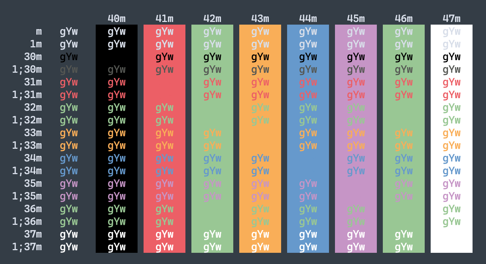

# hyper-mariana

> [Hyper](https://hyper.is) theme inspired by [Sublime Text 4 Mariana Theme](https://github.com/twolfson/sublime-files/blob/master/Packages/Color%20Scheme%20-%20Default/Mariana.sublime-color-scheme)



## Install

```sh
$ hyper install hyper-mariana
```

## License

MIT © [Jimmy Moon](https://jimmy.im)
